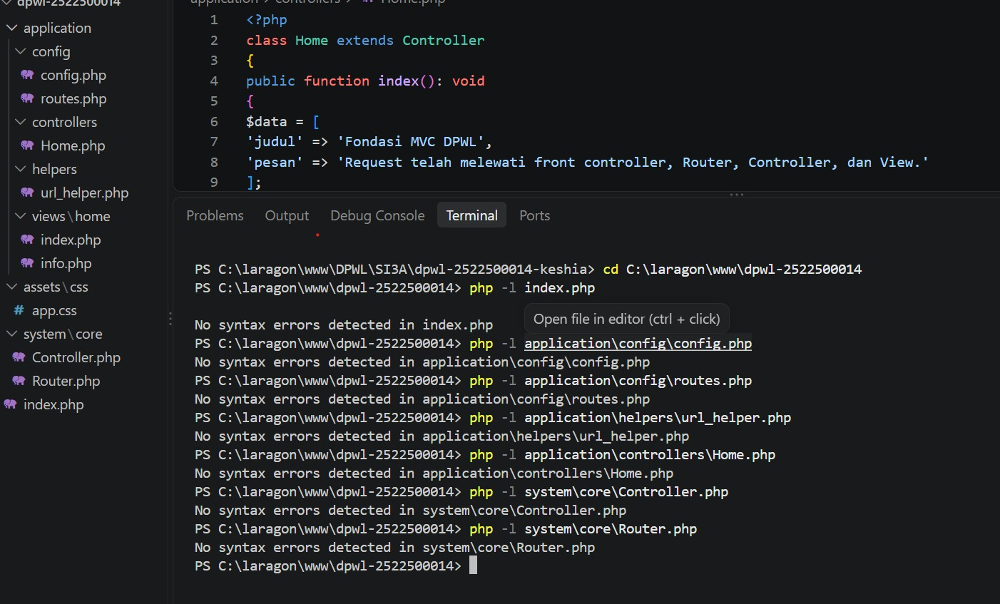
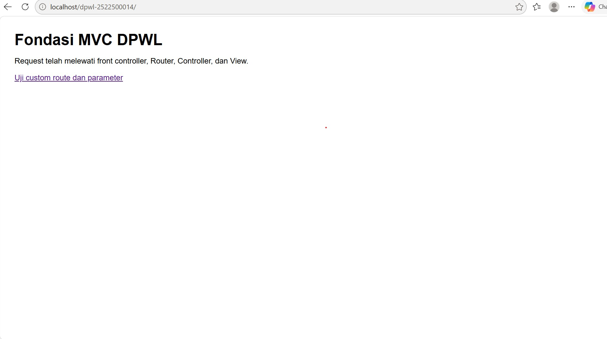
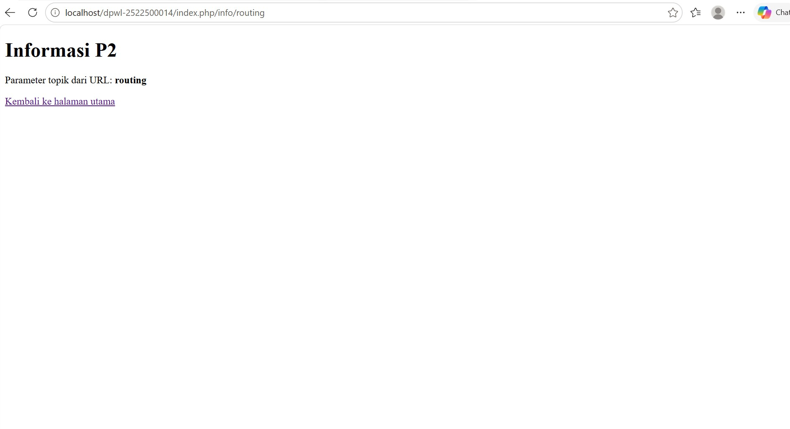

# pertemuan-02
## 1. Tujuan Praktikum
Tujuan dari praktikum pertemuan 2 adalah untuk membuat fondasi dasar dari web menggunakan pola MVC buatan sendiri. Di pertemuan 2 kami baru belajar memahami alur kerja dari sistem pola MVC berjalan, dengan satu titik masuk utama yang disebut Front Controller.
## 2. Struktur Direktori
C:.
│   index.php   (index.php berfungsi sebagai front controller atau sebagai halaman utama dimana request dari user pertama kali di terima)
│   
├───application   (ini merupakan folder utama tempat menyimpan hampir semua logika dan codingan web yang kita buat)
│   ├───config   (berfungsi sebagai tempat setelan awal)
│   │       config.php   (berisi alamat URL utama website)
│   │       routes.php   (mengatur rute akses URL yang diminta user)
│   │       
│   ├───controllers   (controller yang berfungsi sebagai penerima permintaan dari user, mengatur data, dan yang mencari tampilan yang sesuai)
│   │       Home.php   (berisi Controller utama buat ngatur logika halaman awal)
│   │       
│   ├───helpers   (berfungsi sebagai tempat berisinya fungsi" pembantu )
│   │       url_helper.php   (berfungsi sebagai alat bantu khusus yang membuat URL otomatis biar mempermudah user tidak ngetik manual panjang")
│   │       
│   └───views   (sebagai tampilan luar yang berisi HTML/PHP yang ditampilkan di layar user)
│       └───home
│               index.php   (Tampilan untuk halaman utama)
│               info.php   (Tampilan buat halaman informasi)
│               
├───assets   (Berfungsi sebagai tempat nyimpan file pendukung untuk tampilan luar web)
│   └───css
│           app.css   (File CSS untuk ngatur warna halaman web, font yang tampil di web, dan tata letak website agar tertampil rapih)
│           
└───system   (folder ini berisi semua file yang sudah disediakan/bawaan)
    └───core
            Controller.php   (berisi kodingan inti )
            Router.php   (berisi kodingan inti)
## 3. Front controller
Peran utama Front Contoller sebagai satu"nya titik masuk utama bagi semua request yang masuk dari user, apapun request dari user pasti melewati file index.php dulu sebagai front controller.
## 4. Routing dan Pemetaan URL
| URL/Route | Controller | Method | Parameter | View |
|---|---|---|---|---|
| / | Home | index | - | home/index.php |
| home/index | Home | index | - | home/index.php |
| home/info/mvc | Home | info | mvc | home/info.php |
| info/routing | Home | info | routing | home/info.php |
| home/info/sistem | Home | info | sistem | home/info.php |

Tambahkan satu baris untuk route hasil Tahap Modifikasi ATM yang dibuat berdasarkan objek atau konteks
aplikasi DPW, kemudian jelaskan pemetaan route → Controller → method → parameter → View.
(Alamat (route/URL) yang diakses oleh pengguna melalui browser adalah (home/info/sistem), Controller(Home) lalu Router akan menerima request tersebut dan memanggil class Home(Home.php) yang bertindak sebagai pengatur logika aplikasi, Method(info) didalam controller Home, metode bernama info()dieksekusi, lalu Parameter(sistem), objek "sistem" ditangkap sebagai parameter data yang menentukan topik informasi yang ingin ditampilkan, View(home/info.php), controller mengambil data sesuai parameter, lali memuat file tampilan home/info.php untuk menyajikan hasilnya kepada user dilayar browser.)

## 5. Base URL dan Helper
Fungsi base_url(), untuk menghasilkan URL lengkap menuju file yang terdapat di folder
site_url(), berfungsi untuk membentuk URL dan langsung beralih ke halaman yang dihubungkan.
contoh penggunaannya pada implementasi P2:
- base_url() untuk memanggil assets/css/app.css; (<link rel="stylesheet" href="<?= base_url('assets/css/app.css'); ?>">)
- site_url() untuk membentuk URL navigasi/route aplikasi. (<a href="<?= site_url('info/routing') ?>">Link Routing</a>)
## 6. Alur Request-response
Jelaskan dua alur berikut:
1. Alur eksekusi aktual P2:
Browser → index.php → Router → Controller → View → Response.
(1. Di Browser, user mengetik URL, misalnya http://localhost/dpwl-2522500014/index.php/info/routing.
2. Lalu Index.php sebagai Front Controller
3. Router akan membaca URL /info/routing, mencocokan aturan route lalu menentukan controller(home),method(info),dan parameter"routing".
4. Controller menjalankan method(info),menyiapkan data dan memanggil tampilan home/info.php.
5. View akan menggabungkan HTML dengan data yang dikirim Controller.
6. Terakhir Response yang merupakan output yang dihasilkan dikirim ke Browser User.)
2. Posisi Model dalam arsitektur MVC lengkap:
Browser → index.php → Router → Controller → Model → basis data/data → Model → Controller → View →
Response.
Kurang lebih alur eksekusi sama tetapi yang berbeda hanya pada bagian Model yang berada ditengah antara controller dan database, ketika controller membutuhkan data dari database misalnya, data pasien, controller akan meminta data pasien ke model.Lalu model melakukan query ke basis data, mengambil hasilnya lalu mengembalikan data tersebut ke contoller sebelum diteruskan ke view.
## 7. Hasil Pengujian dan Debugging
Jika seluruh implementasi langsung berjalan sesuai hasil yang diharapkan, jelaskan hasil pemeriksaan sintaks dan pengujian yang telah dilakukan.
### Gambar 1. Hasil Pengujian sintaks

semua file yang diuji menunjukan status valid tanpa adanya syntax error.
## 8. Bukti Tangkapan Layar
Sisipkan gambar yang relevan dari folder dokumentasi/ dengan perintah:
### Gambar 1. Hasil Pengujian Halaman Utama

### Gambar 2. Hasil Pengujian Custom Route

## 9. Kesimpulan P2
Pada p2, web yang dibuat udah menggunakan fungsi Front Controller, pemetaan Routing,Helper URL, View secara terstruktur. Web yang diakses User sudah menggunakan satu titik masuk yaitu index.php. Lalu, pada P3 Web akan dikembangkan dengan menambahkan Model.